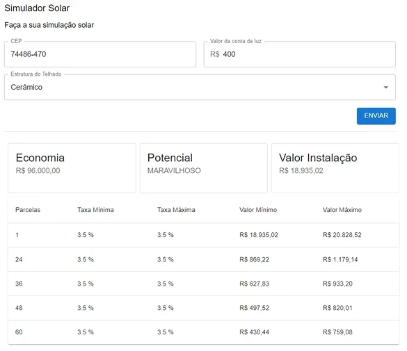

# 🚀 77Sol Challenge - Agenda De Contatos

Este projeto é totalmente responsivo e consiste em um simulador solar
e foi realizado como parte do processo seletivo da empresa [77Sol](https://www.77sol.com.br/).

## Tecnologias

- [React](https://react.dev/)
- [Typescript](https://www.typescriptlang.org/)
- [Vite](https://vitejs.dev/)
- [Material-UI](https://mui.com/)
- [React-Hook-Form](https://react-hook-form.com/)
- [Axios](https://axios-http.com/ptbr/docs/intro)
- [Zod](https://zod.dev/)
- [Storybook](https://storybook.js.org/)
- [TurboRepo](https://turbo.build/)
- [Jest](https://jestjs.io/pt-BR/)
- [Eslint](https://eslint.org/)
- [Prettier](https://prettier.io/)

## Monorepo

Neste projeto foi utilizado Monorepo como estratégia de desenvolvolvimento.

#### Porque utilizei Monorepo neste projeto ?

Via necessidade de utilizar monorepo neste repositório devido a necessidade de separar minha aplicação `solar-simulation-cli` da parte de documentação `docs`.

Neste cenário utilizando monorepo pude separar a documentação `docs` da aplicação `solar-simulation-cli`, fazendo com que eles sejam dois projetos independentes e separados porém que se comunicam entre si e rodam em paralelo.

Essa estrutura me da a possibilidade de por exemplo, de trocar a ferramenta de documentação (storybook) sem afetar minha aplicação.

## Rodando o projeto

1.  Após clonar e acessar o repositório, instale as dependências e inicialize o projeto
    - Instale as dependências:
      - `npm install`
    - Inicialize o projeto:
      - `npm run dev`

Após esses passos, os dois projetos (`solar-simulation-cli`, `docs`) devem rodar na sua maquina com sucesso.

**Caso você queira, pode rodar os projetos separadamente. Veja o guia abaixo para mais informações**

### Rodando os projetos individualmente

#### solar-simulation-cli

1.  Após clonar e acessar o repositório, instale as dependências e inicialize o projeto
    - Instale as dependências:
      - `npm install`
    - Acesse a pasta `solar-simulation-cli` no terminal
    - Inicialize o projeto:
      - `npm run dev`

Após esses passos, o projeto `solar-simulation-cli` deve rodar na sua maquina com sucesso.

#### docs

1.  Após clonar e acessar o repositório, instale as dependências e inicialize o projeto
    - Instale as dependências:
      - `npm install`
    - Acesse a pasta `docs` no terminal
    - Inicialize o projeto:
      - `npm run dev`

Após esses passos, o projeto `docs` deve rodar na sua maquina com sucesso.

## Rodando os testes

1.  Acesse a pasta `solar-simulation-cli` no terminal

    - Execute o comando `npm run test`

### Verificando coverage

1.  Acesse a pasta `solar-simulation-cli` no terminal

    - Execute o comando:
      - `npm run coverage`

## Aprendizados

Aprendi bastante com esse desafio. Pude melhorar minhas habilidades com a Material-UI, monorepo, manipulação de formulários, conceitos de design system e implementação e cobertura de testes.

### Horas gastas

12 horas de desevolvimento.

## Autor

- [Luiz-Fellipe](https://github.com/Luiz-Fellipe)

